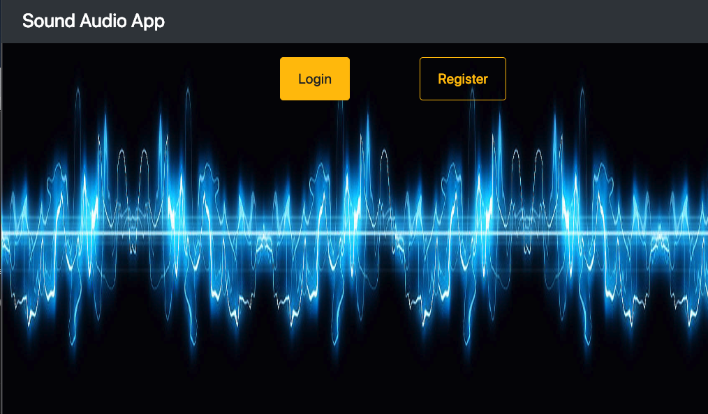

# Sound Audio App

An app for searching sound effects and audio clips. A user can easily search, save, and download audio files if they would like.

## Installing / Getting started

```
- Install dependencies for server
npm install

- Install dependencies for client
npm run client-install

- Run the client & server with concurrently
npm start

Server runs on http://localhost:3002 and client on http://localhost:3000
```

If running locally, you will need to setup your own local development database in the /database/index.js file.

```
const uri = process.env.MONGODB_URI || "mongodb://localhost/YOUR_OWN_LOCAL_DB";

```

### OR

[Visit the live site and create a login!](https://arcane-hollows-95922.herokuapp.com/)

## Technologies

**A MERN Stack App**

_Back-end_

- node.js 10.6.0
- express 4.16.4
- mongoose 5.4.2
- axios 0.18.0
- passport 0.4.0
- passport-local 1.0.0
- bcryptjs 2.4.3

_Front end_

- react 16.7.0
- react-router-dom 4.3.1
- react-audio-player 0.11.0
- reactstrap 7.0.2
